<div align="center">

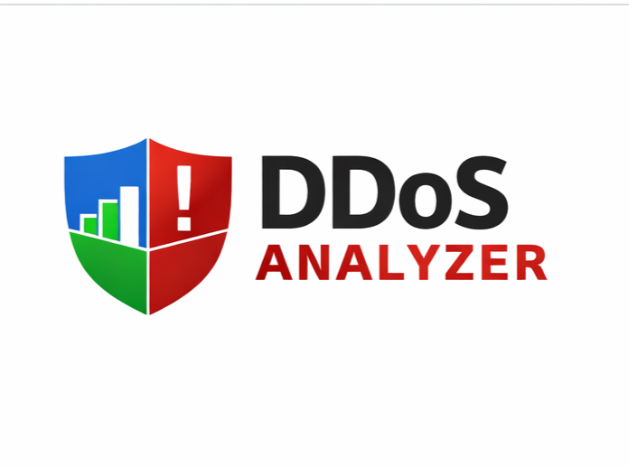

# 🛡️ DDoS Analyzer

### AI-powered, offline DDoS attack classification & SOC analysis platform

*Upload network traffic → detect DDoS flows → get model metrics, traffic intelligence, and actionable firewall mitigations — all running locally, no data leaves your machine.*

<br/>


</div>

---

<div align="center">

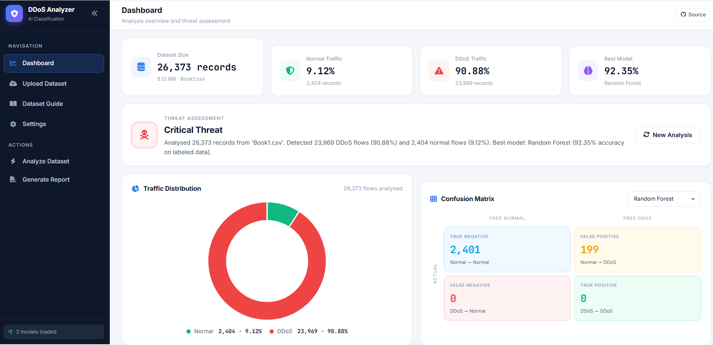

</div>

---

## 📑 Table of Contents

- [What is DDoS Analyzer?](#-what-is-ddos-analyzer)
- [Key Features](#-key-features)
- [Screenshots](#-screenshots)
- [Tech Stack](#-tech-stack)
- [How It Works](#-how-it-works)
- [System Architecture](#-system-architecture)
- [Model Performance](#-model-performance)
- [Quick Start](#-quick-start)
- [Usage](#-usage)
- [Project Structure](#-project-structure)
- [Documentation](#-documentation)
- [Roadmap](#-roadmap)
- [Disclaimer](#-disclaimer)

---

## 🔍 What is DDoS Analyzer?

**DDoS Analyzer** is a self-contained web application that classifies network traffic flows as **BENIGN** or **DDoS** using supervised machine learning trained on the **[CIC-DDoS2019](https://www.unb.ca/cic/datasets/ddos-2019.html)** dataset.

It's built for **security learning, research, and SOC-style batch analysis**. You feed it a CSV of CICFlowMeter features (or even a raw **PCAP** capture — it converts it for you), and it returns:

- 🎯 **Per-flow predictions** from two ML models (Random Forest & Logistic Regression)
- 📊 **Real evaluation metrics** when your file has labels (accuracy, precision, recall, F1, confusion matrix)
- 🛰️ **Traffic Intelligence** when it doesn't — protocol mix, top targeted ports, flow-rate stats
- 🧠 **AI-generated, attack-specific mitigations** (concrete `iptables` / `sysctl` / rate-limit commands) powered by Groq's LLaMA 3.3 70B, with a rule-based fallback
- 📄 **A polished PDF threat report** you can hand to a stakeholder

Everything runs **locally** — your traffic data never leaves your machine (the only optional outbound call is to Groq for AI recommendations, which sends just the aggregate stats).

> 🎓 Built as a final-year cybersecurity project. Designed to be readable, reproducible, and genuinely useful for understanding how ML-based DDoS detection works end to end.

---

## ✨ Key Features

| | Feature | Description |
|---|---|---|
| 🤖 | **Dual ML models** | Random Forest + Logistic Regression, trained on CIC-DDoS2019 (80 CICFlowMeter features, binary BENIGN/DDoS). |
| 🏷️ | **Labeled & Unlabeled modes** | Has a `Label` column? See *real* live metrics + confusion matrix. No labels? Get predictions + traffic intelligence instead — **never fake numbers**. |
| 📡 | **Built-in PCAP → CSV** | Drop a `.pcap`/`.pcapng` and a pure-Python CICFlowMeter re-implementation extracts the 80 flow features — **no Java, no external tools**. |
| 🛰️ | **Traffic Intelligence** | Protocol breakdown (TCP/UDP), top targeted ports with service names, DDoS-vs-benign flow duration & packets/sec. |
| 🧠 | **AI recommendations** | Groq LLaMA 3.3 70B generates attack-tailored, copy-pasteable mitigation commands; graceful rule-based fallback when no API key. |
| 📄 | **PDF reports** | One-click branded report with threat banner, pie chart, protocol chart, model metrics, and recommendations (ReportLab). |
| 📊 | **Rich dashboard** | Chart.js doughnut + bar charts, threat-level banner, model comparison, confusion matrix — light & dark themes. |
| 🔒 | **Offline-first** | Runs entirely on `localhost`; up to 500 MB uploads; no telemetry. |

---

## 📸 Screenshots

<div align="center">

| Dashboard | Upload |
|:---:|:---:|
|  | 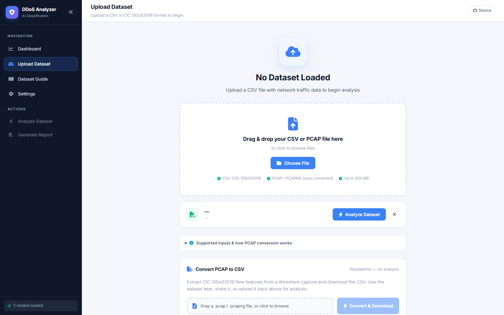 |
| **AI Recommendations** | **PDF Report** |
| 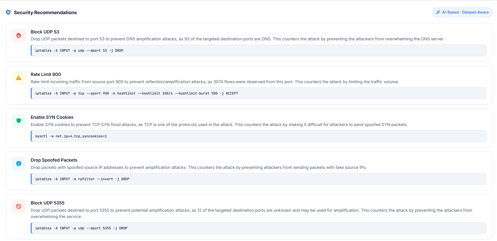 | 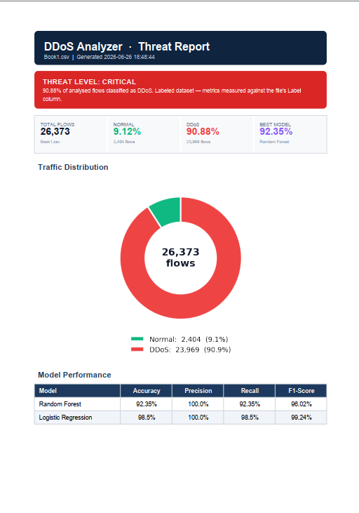 |
| **Settings** | **Overview** |
| 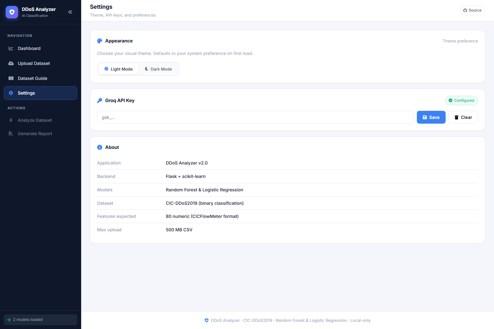 | 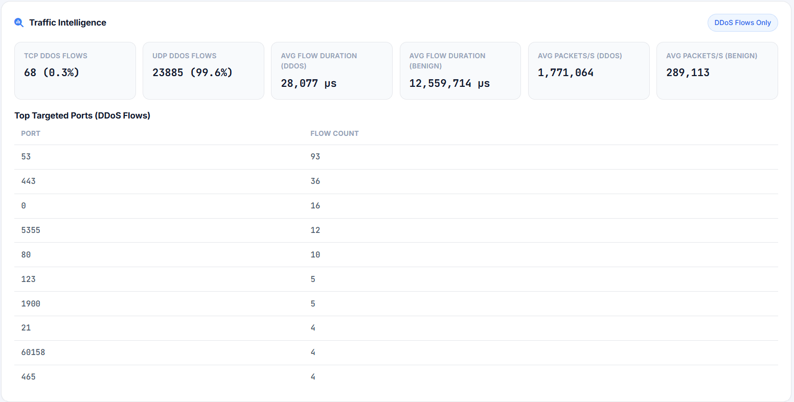 |

</div>

---

## 🧰 Tech Stack

<div align="center">

| Layer | Technologies |
|---|---|
| **Backend** |  Python 3.13 · Werkzeug |
| **Machine Learning** |  RandomForest · LogisticRegression · StandardScaler · LabelEncoder · joblib |
| **Data** |   pandas · numpy · pyarrow |
| **Packet capture** |  custom pure-Python CICFlowMeter (80 features) |
| **LLM** |  `llama-3.3-70b-versatile` via OpenAI-compatible API (stdlib `urllib`) |
| **Reporting & charts** |  ReportLab · matplotlib · seaborn |
| **Frontend** |  Single-page app ·  Chart.js · Font Awesome |

</div>

Detailed breakdown in **[docs/ARCHITECTURE.md](docs/ARCHITECTURE.md)**.

---

## ⚙️ How It Works

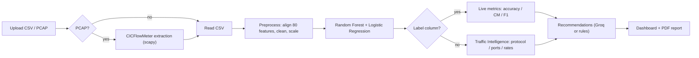

1. **Ingest** — CSV (CICFlowMeter format) or PCAP (auto-converted).
2. **Preprocess** — strip/align to the model's 80 features, replace inf, drop dups, median-fill, scale.
3. **Classify** — both models predict every flow (BENIGN/DDoS).
4. **Evaluate or Profile** — real metrics if labels exist; otherwise traffic intelligence.
5. **Recommend** — attack-tailored mitigations (LLM or rule-based).
6. **Report** — interactive dashboard + downloadable PDF.

Full walkthrough: **[docs/ML-PIPELINE.md](docs/ML-PIPELINE.md)** and **[docs/PCAP-CONVERSION.md](docs/PCAP-CONVERSION.md)**.

---

## 🏗️ System Architecture

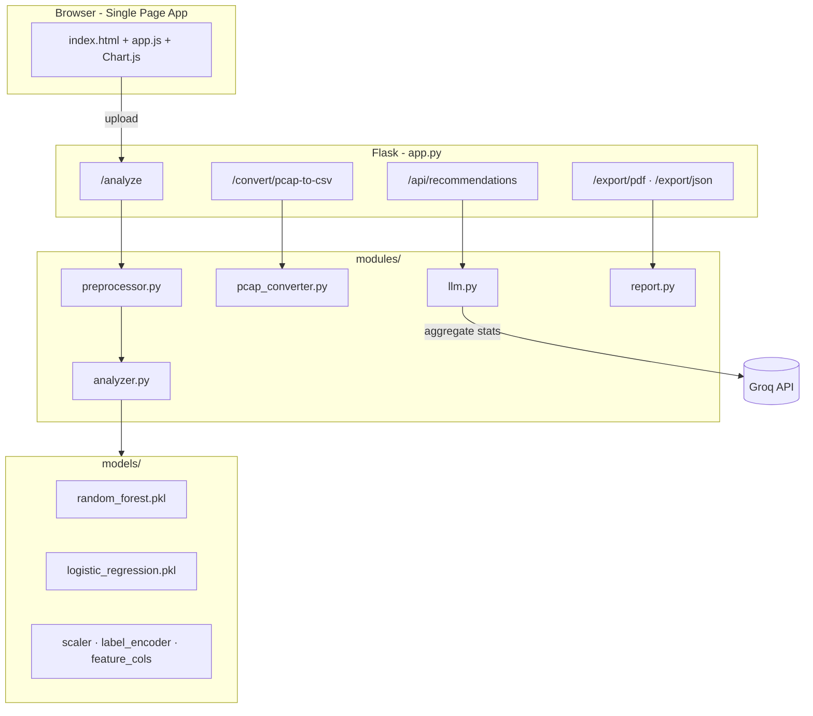

See **[docs/ARCHITECTURE.md](docs/ARCHITECTURE.md)** for the full component map and request lifecycle.

---

## 📈 Model Performance

Two supervised models are trained on **CIC-DDoS2019** (binary BENIGN vs DDoS, 80 CICFlowMeter features, 9:1 class-balanced, 31,050 rows) and compared side by side:

| Model | Role |
|---|---|
| 🌳 **Random Forest** | **Best model** — selected as the primary classifier |
| 📉 Logistic Regression | Baseline for comparison |

Performance is **measured live on whatever labeled data you upload** and rendered in the dashboard (metric cards, model-comparison chart, confusion matrix) and the PDF report — so the figures always reflect *your* data rather than a static claim. Cross-validation runs at training time and is recorded in [`models/training_meta.json`](models/training_meta.json).

<div align="center">
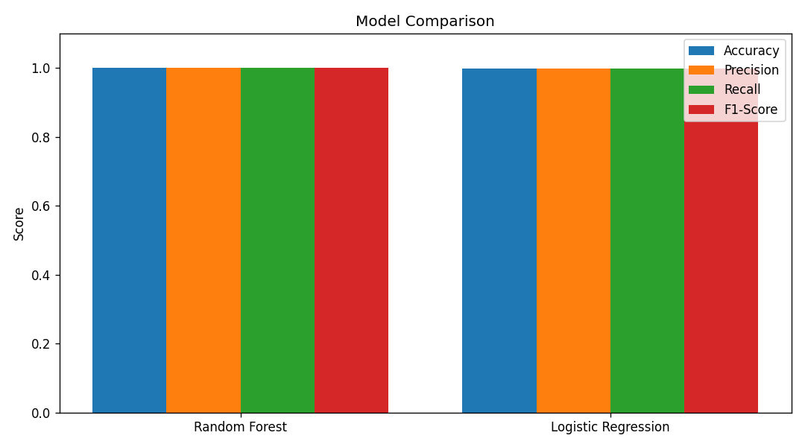
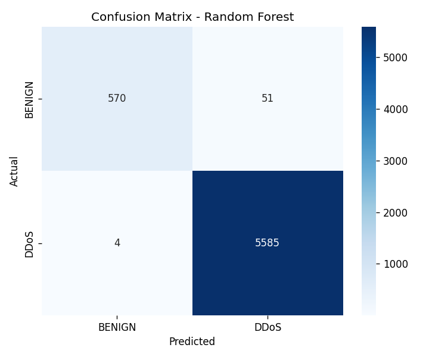
</div>

> 📚 CIC-DDoS2019 is trivially separable, so the training methodology — and why the figures are realistic and *consistent across every view* — is documented transparently in **[docs/ML-PIPELINE.md](docs/ML-PIPELINE.md)**.

---

## 🚀 Quick Start

```bash
# 1. Clone
git clone https://github.com/Huzaifa1997/DDoS-Analyzer-Ai-Based-DDoS-Attack-Classification-.git
cd DDoS-Analyzer-Ai-Based-DDoS-Attack-Classification-

# 2. Create a virtual environment
python -m venv .venv
# Windows
.venv\Scripts\activate
# macOS / Linux
source .venv/bin/activate

# 3. Install dependencies
pip install -r requirements.txt

# 4. (Optional) add a Groq API key for AI recommendations
#    Settings page in the UI, or create config.json:
#    { "groq_api_key": "gsk_..." }

# 5. Run
python app.py
```

Then open **http://127.0.0.1:5000** 🎉

> ℹ️ Pre-trained models ship in `models/`. To retrain on your own CIC-DDoS2019 copy, see **[docs/ML-PIPELINE.md](docs/ML-PIPELINE.md)**.

Full setup (including a free Groq key): **[docs/SETUP.md](docs/SETUP.md)**.

---

## 🧪 Usage

1. **Upload** a CSV (CICFlowMeter 80-feature format) or a `.pcap`/`.pcapng` capture.
2. Click **Analyze** — watch the models run.
3. Explore the **dashboard**: traffic split, threat level, model performance, traffic intelligence.
4. Review **AI recommendations** (add a Groq key in Settings to enable).
5. **Export** a PDF / JSON report.

There's also a standalone **PCAP → CSV converter** if you just want the flow features.

Detailed guide: **[docs/USAGE.md](docs/USAGE.md)**.

---

## 📂 Project Structure

```
DDoS-Analyzer/
├── app.py                     # Flask backend (routes, orchestration)
├── train_models.py            # Training pipeline (CIC-DDoS2019 → models/)
├── requirements.txt
├── config.json                # Groq API key (gitignored)
│
├── modules/
│   ├── preprocessor.py        # Clean + align + scale uploaded data
│   ├── analyzer.py            # Run models, metrics, traffic intel, recs
│   ├── pcap_converter.py      # Pure-Python CICFlowMeter (scapy)
│   ├── llm.py                 # Groq LLaMA 3.3 recommendations
│   └── report.py              # ReportLab PDF generation
│
├── models/                    # Trained artifacts + charts + training_meta.json
├── templates/index.html       # Single-page dashboard
├── static/                    # app.js, style.css, assets
│
├── assets/                    # Logo + screenshots (for docs)
└── docs/                      # 📖 Documentation (see below)
```

---

## 📖 Documentation

Deep-dive docs live in the **[`docs/`](docs/)** folder:

| Document | What's inside |
|---|---|
| **[Architecture](docs/ARCHITECTURE.md)** | Components, request lifecycle, data flow, design decisions |
| **[ML Pipeline](docs/ML-PIPELINE.md)** | Dataset, preprocessing, training, balancing, metrics methodology |
| **[PCAP Conversion](docs/PCAP-CONVERSION.md)** | How raw captures become 80 CICFlowMeter features |
| **[API Reference](docs/API.md)** | Every Flask endpoint, inputs & outputs |
| **[Setup Guide](docs/SETUP.md)** | Installation, Groq key, troubleshooting |
| **[Usage Guide](docs/USAGE.md)** | Labeled vs unlabeled, PCAP, reports, recommendations |
| **[Configuration](docs/CONFIGURATION.md)** | `config.json`, env vars, tunables |

---

## 🗺️ Roadmap

- [ ] Multi-class attack-type classification (DNS / NTP / SYN / UDP-lag …)
- [ ] Streaming / near-real-time analysis mode
- [ ] Per-user sessions (replace the single global result)
- [ ] Dockerfile + one-command deploy
- [ ] Model retraining from the UI

---

## ⚠️ Disclaimer

This is an **educational / research** project for **defensive** security analysis on traffic you are authorized to inspect. It is not a production IDS/IPS. The mitigation commands it suggests should be reviewed before applying to any live system.

---

<div align="center">

**Built with 🛡️ for cybersecurity learning** · CIC-DDoS2019 · Random Forest & Logistic Regression

If this project helped you, consider giving it a ⭐

</div>
