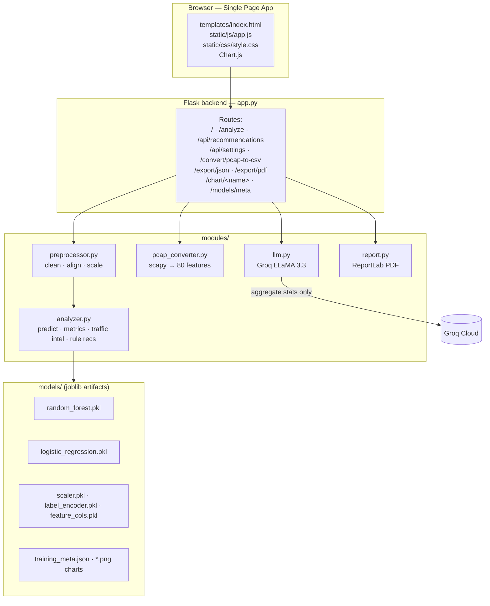
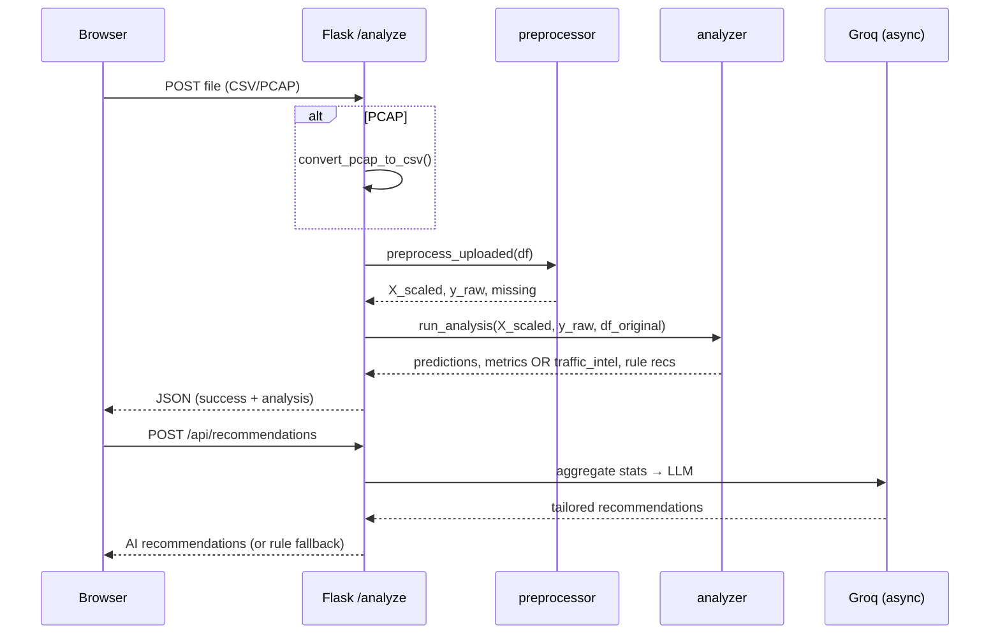

# 🏗️ Architecture

DDoS Analyzer is a single-process **Flask** application with a single-page frontend. There is no database — trained model artifacts are loaded from disk and the most recent analysis is held in memory for export.

## Component map

## Backend modules

| File | Responsibility |
|---|---|
| **`app.py`** | Flask routes, file handling, orchestration, in-memory `_last_result`, config (Groq key) load/save. |
| **`modules/preprocessor.py`** | `load_artifacts()` (scaler, label encoder, feature list); `preprocess_uploaded()` — strip column names, replace ±inf, drop duplicates, align to the 80 training features (missing → 0, with a warning if >10 missing), median-fill, scale. Returns `(X_scaled, y_raw, missing_count)`. |
| **`modules/analyzer.py`** | `run_analysis()` — runs both models; if labels present computes **live** metrics + 2×2 confusion matrix, else sets them to `None`; computes traffic counts and `traffic_intel`. `extract_traffic_features()` — protocol mix, top ports, flow stats. `build_recommendations()` — attack-tailored rule-based mitigations. |
| **`modules/pcap_converter.py`** | Pure-Python CICFlowMeter re-implementation using **scapy**. `is_pcap()`, `convert_pcap_to_csv()`. See [PCAP-CONVERSION.md](PCAP-CONVERSION.md). |
| **`modules/llm.py`** | Groq integration (`llama-3.3-70b-versatile`, OpenAI-compatible Chat Completions via stdlib `urllib`). Builds an attack-context prompt, parses/sanitizes a JSON array of recommendations (with `command` field). |
| **`modules/report.py`** | ReportLab PDF: header band, threat banner, metric cards, matplotlib charts (donut, protocol bar, model bar), confusion matrix, recommendations, footer. |

## Request lifecycle — `/analyze`

## Key design decisions

- **Offline-first.** All processing is local. The only optional outbound request is to Groq for AI recommendations, and it sends **only aggregate statistics** (counts, protocol mix, top ports) — never raw flows.
- **Labeled vs unlabeled honesty.** When a file has no `Label` column, the app shows predictions + traffic intelligence and explicitly marks accuracy as **N/A** rather than displaying training-time numbers as if they were live. See [ML-PIPELINE.md](ML-PIPELINE.md).
- **Schema stability.** The model's 80-feature schema matches exactly what `pcap_converter.py` emits, so PCAP and CSV inputs flow through the same pipeline.
- **Graceful degradation.** No Groq key → rule-based recommendations. Missing features → filled with 0 + warning. Traffic intel columns absent → that field is simply omitted.

## Known limitations

- `_last_result` is a module-level global, so the app is effectively **single-user** (concurrent users would overwrite each other's results).
- `app.run(debug=True)` is for development only — disable for any deployment.
- PCAP-derived features are an **approximation** of CICFlowMeter; the scaler was fit on CSV data, so PCAP predictions are less reliable than CSV ones.
