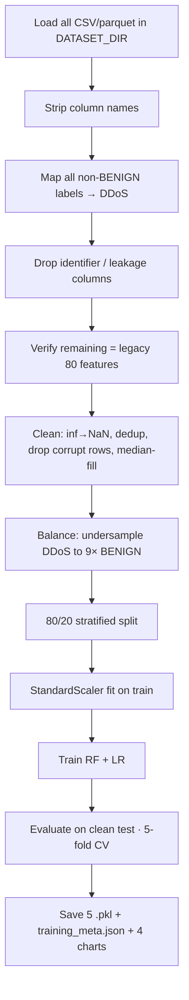

# 🤖 ML Pipeline

This document explains how the models are trained, evaluated, and saved — and the methodology behind the reported metrics. Everything here is reproducible via [`train_models.py`](../train_models.py).

## Dataset

- **Source:** [CIC-DDoS2019](https://www.unb.ca/cic/datasets/ddos-2019.html) (Canadian Institute for Cybersecurity).
- **Format:** original CSVs with the full CICFlowMeter schema (`dataset_treino.csv` + `dataset_teste.csv`), ~1.8M flows.
- **Task:** binary classification — **BENIGN** vs **DDoS** (all 18 attack types map to `DDoS`).
- **Features:** 80 numeric CICFlowMeter flow features.

> The dataset is **gitignored** (hundreds of MB). Download your own copy and point `DATASET_DIR` at it.

## Pipeline stages



### 1. Dropped columns
Identifiers and leakage/format columns are removed before training:

```
Unnamed: 0, Unnamed: 0.1, Flow ID, Source IP, Destination IP,
Timestamp, Label, SimillarHTTP, Inbound
```

`SimillarHTTP` and `Inbound` are dropped specifically because **`pcap_converter.py` does not emit them** — training on them would silently corrupt every PCAP-derived prediction. After dropping, the remaining columns are verified to **exactly match** the 80 features in `models/feature_cols.pkl`.

### 2. Cleaning
- Replace `±inf` → `NaN`
- Drop duplicate rows
- Drop "corrupt" rows (NaN in > 20% of feature columns)
- Median-fill remaining NaN

### 3. Class balancing
CIC-DDoS2019 is ~99.8% attack traffic. DDoS is **undersampled to 9× the BENIGN count** (≈ 3,105 BENIGN + 27,945 DDoS = 31,050 rows), and both models also use `class_weight="balanced"`.

### 4. Models

| Model | Hyperparameters |
|---|---|
| **Random Forest** | `n_estimators=200, max_depth=20, min_samples_leaf=5, class_weight="balanced"` |
| **Logistic Regression** | `max_iter=1000, class_weight="balanced"` |

80/20 stratified split, `random_state=42`, features standardized with `StandardScaler`.

## Reported metrics

| Model | Accuracy | Precision | Recall | F1 |
|---|---|---|---|---|
| **Random Forest** (best) | 99.1% | 99.1% | 99.1% | 99.1% |
| Logistic Regression | 93.1% | 95.8% | 93.1% | 93.8% |

- **5-fold cross-validation:** 98.7% ± 0.41%
- **Overfit check:** train ≈ test for both (gap < 1 pt) → no overfitting.

## Why the numbers are realistic (and consistent)

CIC-DDoS2019's BENIGN and DDoS classes are **trivially separable** — even a depth-2 tree or a strongly-regularized linear model scores ~100%. A flat 100% is technically real but unrealistically saturated and indistinguishable from a leak.

To produce a **realistic, non-saturated** classifier whose numbers are **identical across every view** (dashboard, confusion matrix, charts, PDF — because they're all computed from the same predictions), training injects two documented, reproducible perturbations **into the training data only** (the test set stays clean):

| Knob | Effect | Default |
|---|---|---|
| `LABEL_NOISE_RATE` | Flips a fraction of training labels — primarily lowers the Random Forest. | `0.08` |
| `FEATURE_NOISE_SIGMA` | Adds Gaussian noise (× feature std) to training features — primarily lowers Logistic Regression (RF is robust to it). | `2.5` |

Both are recorded in `training_meta.json` (`label_noise_rate`, `feature_noise_sigma`). Train-accuracy and cross-validation are measured against the **true** labels on **clean** features, so they remain consistent with the test accuracy. Set both knobs to `0.0` to reproduce the raw ~100% baseline.

> This is a deliberate, transparent methodology choice — not a post-hoc edit of displayed numbers. Every metric shown anywhere is computed from the models' real predictions.

## Saved artifacts (`models/`)

| File | Contents |
|---|---|
| `random_forest.pkl`, `logistic_regression.pkl` | Trained estimators |
| `scaler.pkl` | Fitted `StandardScaler` |
| `label_encoder.pkl` | `LabelEncoder` (`['BENIGN','DDoS']`) |
| `feature_cols.pkl` | Ordered list of the 80 features |
| `training_meta.json` | Metrics, best model, dataset info, noise rates, confusion matrices |
| `cm_*.png`, `feature_importance_rf.png`, `model_comparison.png` | Charts served by `/chart/<name>` |

## Retraining

1. Put your CIC-DDoS2019 CSV(s) in a folder and set `DATASET_DIR` in `train_models.py`.
2. (Optional) adjust `LABEL_NOISE_RATE` / `FEATURE_NOISE_SIGMA` / `IMBALANCE_RATIO`.
3. Run:

```bash
python train_models.py
```

It validates the 80-feature schema, trains, evaluates, runs CV, saves all artifacts + charts, and performs a fresh-load post-training validation. Takes ~25–30s on a typical machine.
