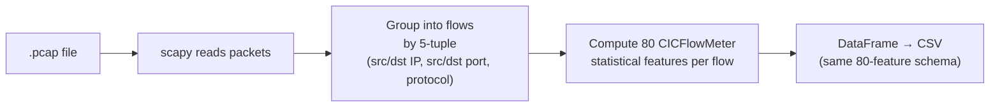

# 📡 PCAP → CSV Conversion

DDoS Analyzer can ingest raw packet captures (`.pcap`, `.pcapng`, `.cap`) directly. [`modules/pcap_converter.py`](../modules/pcap_converter.py) is a **pure-Python re-implementation of CICFlowMeter** built on **scapy** — no Java, no external binaries.

## How it works

1. **Read** — scapy parses the capture into packets.
2. **Group** — packets are grouped into bidirectional flows keyed by the 5-tuple.
3. **Featurize** — for each flow, the converter computes the 80 CICFlowMeter features: durations, packet/byte counts and lengths (fwd/bwd), inter-arrival times (IAT), flag counts, flow rates (bytes/s, packets/s), header lengths, sub-flow stats, active/idle times, etc.
4. **Emit** — a DataFrame with exactly the 80 columns the models expect, written to CSV.

## Public functions

| Function | Description |
|---|---|
| `is_pcap(filename)` | True if the filename looks like a capture (`.pcap`/`.pcapng`/`.cap`). |
| `convert_pcap_to_csv(pcap_path, csv_path)` | Converts a capture to a feature CSV. Returns `{"flows": N, "columns": M}`. Raises `PcapConversionError` on failure. |

## Two ways to use it

- **Analyze directly** — upload a PCAP on the main page; the app converts it, then runs the full analysis pipeline.
- **Standalone converter** — the "Convert PCAP to CSV" tool (and `POST /convert/pcap-to-csv`) just returns the feature CSV for download, with no analysis.

## ⚠️ Accuracy caveat

PCAP-derived features **approximate** the official CICFlowMeter output, and the model's `StandardScaler` was fit on CSV (CICFlowMeter) data. As a result:

- **CSV input** (already in CICFlowMeter format) gives the most reliable predictions.
- **PCAP input** is convenient and great for demos/experiments, but treat its predictions as indicative rather than authoritative.

The feature column names and order are kept identical to the training schema so that any small discrepancies are limited to feature *values*, not structure.
