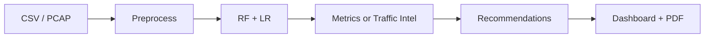

# 📖 DDoS Analyzer — Documentation

Welcome to the technical documentation. These guides explain how DDoS Analyzer works under the hood and how to set it up, use it, and extend it.

| Document | Read this if you want to… |
|---|---|
| **[Architecture](ARCHITECTURE.md)** | Understand the components, request lifecycle, and how data flows through the app |
| **[ML Pipeline](ML-PIPELINE.md)** | Understand the dataset, preprocessing, model training, balancing, and metrics |
| **[PCAP Conversion](PCAP-CONVERSION.md)** | Understand how raw packet captures become 80 CICFlowMeter features |
| **[API Reference](API.md)** | Call the Flask endpoints directly / integrate with another tool |
| **[Setup Guide](SETUP.md)** | Install, configure a Groq key, and troubleshoot |
| **[Usage Guide](USAGE.md)** | Drive the app: labeled vs unlabeled, PCAP, reports, recommendations |
| **[Configuration](CONFIGURATION.md)** | Tune the app and the training pipeline |

## TL;DR

DDoS Analyzer is a **Flask** web app that classifies network flows as **BENIGN** or **DDoS** using two **scikit-learn** models (Random Forest + Logistic Regression) trained on **CIC-DDoS2019**. It accepts CSV or PCAP input, produces real metrics (labeled data) or traffic intelligence (unlabeled data), generates AI/rule-based mitigation recommendations, and exports a PDF report — all offline.

Start with **[Setup](SETUP.md)** → then **[Usage](USAGE.md)**.
